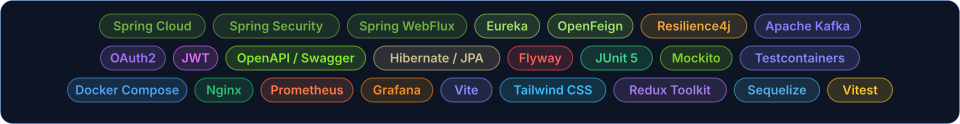

<p align="center">
  
</p>

<p align="center">
  
</p>

<p align="center">
  <a href="https://adrian0511.dev"></a>
  <a href="https://linkedin.com/in/adrdev"></a>
  <a href="https://github.com/adrian0511?tab=repositories"></a>
</p>

---

## Sobre mí

Desarrollador **backend** centrado en Java y el ecosistema Spring, con foco en **sistemas
distribuidos**: microservicios, mensajería asíncrona y APIs documentadas por contrato. Trabajo
también el lado cliente (React, TypeScript) porque diseñar bien una API exige entender a quien
la consume.

- Microservicios con **Spring Boot 4** y **Spring Cloud** — Eureka, Gateway, OpenFeign, Resilience4j
- Arquitecturas *event-driven* con **Apache Kafka** y patrón saga entre servicios
- Contratos de API con **OpenAPI / Swagger**, seguridad con **OAuth2** y **JWT**
- **Arquitectura hexagonal** y DDD, con tests en todas las capas (JUnit 5, Mockito, Vitest)
- SPAs con **React**, **TypeScript** y **Vite**, y APIs en **Python / FastAPI**
- Despliegue con **Docker Compose**, **Nginx** y observabilidad con **Prometheus** y **Grafana**

Santa Cruz de Bezana, Cantabria (España) · [adrian0511.dev](https://adrian0511.dev)

---

## Publicado en Maven Central

**[`prompt-link`](https://github.com/adrian0511/prompt-link)** — cliente Java reutilizable para IA
generativa a través de OpenRouter, con auto-configuración de Spring Boot.
Disponible en **Maven Central** como `io.github.adrian0511:prompt-link`, versión **1.1.0**.

```xml
<dependency>
    <groupId>io.github.adrian0511</groupId>
    <artifactId>prompt-link</artifactId>
    <version>1.1.0</version>
</dependency>
```

- Auto-configuración: basta con añadir la dependencia, sin `@EnableFeignClients`
- Cliente Feign **aislado** — el interceptor de la API key vive solo en su contexto, así que la
  clave no se filtra a otros clientes Feign de la aplicación
- Errores **tipados** (`AiClientException`): distingue error de API, de red, respuesta inutilizable
  y fallo de configuración
- *Streaming* de tokens con `Flux<String>` sobre WebFlux, y conversaciones multi-turno

---

## Proyectos

| Proyecto | Qué es | Stack |
|---|---|---|
| **[orderflow](https://github.com/adrian0511/orderflow)** | Plataforma de pedidos sobre **9 microservicios**: catálogo, reserva de inventario, pago simulado y notificación por correo, coordinados por eventos. | Java 21 · Spring Boot 4 · Kafka · OAuth2 *Authorization Code* · Eureka · Gateway · Resilience4j · OpenAPI |
| **[finance-tracker](https://github.com/adrian0511/finance-tracker)** | Gestión de finanzas personales con asistente de IA que categoriza movimientos. Un solo artefacto: el backend sirve el cliente React desde el propio jar, sin CORS ni doble despliegue. | Spring Boot · React · PostgreSQL · JWT · IA generativa |
| **[cookbook](https://github.com/adrian0511/cookbook)** | Gestor de recetas full-stack con **arquitectura hexagonal** (puertos y adaptadores), invariantes de dominio, paginación, búsqueda por ingrediente y valoraciones. **102 tests**. | Java 21 · Spring Boot 4.1 · React 19 · Vite · Tailwind 4 · PostgreSQL 16 · Docker |
| **[portfolio](https://github.com/adrian0511/portfolio)** · [en vivo](https://adrian0511.dev) | Portfolio reactivo que consume la API de GitHub en tiempo real, con *timeouts*, *fallback* e i18n español/inglés. | Spring WebFlux · React 18 · Vite · JUnit 5 · Vitest |
| **[gym-reservas](https://github.com/adrian0511/gym-reservas)** | Reservas de clases de gimnasio con cupos en tiempo real, lista de espera y control de acceso por roles. | NestJS · React 18 · TypeScript · Sequelize · PostgreSQL 16 · Tailwind |
| **[ride-hailing-microservices](https://github.com/adrian0511/ride-hailing-microservices)** | Microservicios de *ride hailing* con autenticación centralizada: `authorization_code` para usuarios y `client_credentials` entre servicios. | Spring Cloud · OAuth2 · JWT · Eureka · OpenFeign · Circuit Breaker |
| **[bug-hunt](https://github.com/adrian0511/bug-hunt)** | Dos retos que comparten un mismo *token bucket* implementado **una sola vez**: filtro `stdin → stdout` y acortador de URLs con *rate limiting* por IP. | Python 3.12 · FastAPI · SQLite |
| **[distributed-ecommerce-platform](https://github.com/adrian0511/distributed-ecommerce-platform)** | E-commerce distribuido con descubrimiento de servicios y cortocircuito ante fallos. | Spring Boot · Eureka · Gateway · Resilience4j · PostgreSQL |

> El resto de repositorios, en **[github.com/adrian0511?tab=repositories](https://github.com/adrian0511?tab=repositories)**

---

## Stack

<p align="center">
  
</p>

<p align="center">
  
</p>

---

## Arquitectura y enfoque

| Área | Cómo lo trabajo |
|---|---|
| **Diseño de APIs** | Contrato primero con OpenAPI, documentación viva en Swagger UI, validación con Postman |
| **Microservicios** | Spring Cloud Gateway como entrada única, Eureka para descubrimiento, OpenFeign entre servicios |
| **Resiliencia** | Circuit breaker y *fallbacks* con Resilience4j, *timeouts* explícitos, degradación controlada |
| **Event-driven** | Kafka para desacoplar servicios; saga para consistencia eventual en pedidos y pagos |
| **Seguridad** | Spring Security + OAuth2 Authorization Server, JWT con *scopes* y roles |
| **Arquitectura** | Hexagonal y DDD: el dominio no conoce a Spring ni a la base de datos |
| **Testing** | JUnit 5, Mockito, AssertJ y *slices* de Spring en backend; Vitest y Testing Library en frontend |
| **Persistencia** | PostgreSQL y MySQL con JPA/Hibernate; Sequelize en NestJS; SQLAlchemy en Python |
| **Infraestructura** | Docker Compose, Nginx como *reverse proxy*, métricas con Prometheus y paneles en Grafana |

---

## Contribuciones

<p align="center">
  <picture>
    <source media="(prefers-color-scheme: dark)" srcset="https://raw.githubusercontent.com/adrian0511/adrian0511/output/github-contribution-grid-snake-dark.svg" />
    
  </picture>
</p>

---

## En qué estoy ahora

- Manteniendo **prompt-link** en Maven Central: *streaming*, errores tipados y compatibilidad con Spring Boot 4.
- Llevando el patrón **saga** de `orderflow` a un flujo con compensaciones completas sobre Kafka.
- Consolidando la **arquitectura hexagonal** de `cookbook` como plantilla base para nuevos servicios.
- Observabilidad de extremo a extremo: métricas de Spring Actuator en Prometheus y paneles en Grafana.

---

<p align="center">
  <a href="https://adrian0511.dev"></a>
  <a href="https://linkedin.com/in/adrdev"></a>
</p>

<p align="center">
  <i>Siempre aprendiendo · Siempre construyendo · Siempre enviando</i>
</p>
